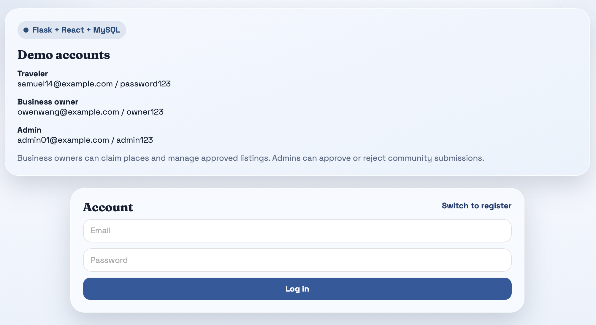

# Travel Explore Vancouver

A Vancouver-focused travel planning web app built with Flask, React, and MySQL.

This project lets travelers organize trip lists and discover places around Vancouver, while business owners can create and manage listings through a role-based workflow. The app uses a Flask backend, a React SPA front end, and a MySQL database for persistent data.

## Highlights

- Role-based experience for travelers and business owners
- Login-first interface with a polished landing screen
- Vancouver-themed visual design
- Trip-list planning workflow backed by MySQL
- Flask API + React SPA architecture

## Preview

### Landing Screen


### Login Screen



## Overview

- Travelers can create, edit, reorder, and manage trip lists
- Travelers can explore places and save them directly into a trip list
- Business owners can create new place listings and update the ones they manage
- The app includes role-based login and a login-first interface
- Data is stored in MySQL and seeded with sample Vancouver content

## Tech Stack

- Backend: Flask
- Frontend: React (served through Flask)
- Database: MySQL
- Environment management: `python-dotenv`

## Current User Flows

### Traveler

- Log in to a traveler account
- Create and manage a trip list
- Browse places from the traveler workspace
- Open place details and save places into a selected list
- Edit list title, description, visibility, and ordering

### Business Owner

- Log in to a business owner account
- Create a new place listing
- Browse existing places
- Open a place and update listing details if the owner can manage it

## Demo Accounts

Use the seeded accounts below after loading the database:

- Traveler: `samuel14@example.com` / `password123`
- Traveler: `miachan@example.com` / `password123`
- Business owner: `owenwang@example.com` / `owner123`
- Admin: `admin01@example.com` / `admin123`

## Project Structure

```text
app/
  routes/        Flask routes and API handlers
  static/        CSS, JS, and UI assets
  templates/     Flask templates
docs/
  images/        README screenshots
sql/
  schema.sql     Database schema
  seed.sql       Sample Vancouver data
run.py           App entry point
config.py        Environment-based configuration
```

## Local Setup

### 1. Install dependencies

Create and activate a virtual environment, then install:

```bash
pip install -r requirements.txt
```

### 2. Configure environment variables

Create a local `.env` file in the project root using `.env.example`:

```env
SECRET_KEY=example-secret-key
DB_HOST=localhost
DB_PORT=3306
DB_NAME=travel_app
DB_USER=root
DB_PASSWORD=example-mysql-password
```

### 3. Create and load the database

Make sure MySQL is running

```bash
mysql -u root -p
```
Inside the MySQL prompt, run:

```bash
CREATE DATABASE IF NOT EXISTS travel_app;
USE travel_app;
source sql/schema.sql;
source sql/seed.sql;
```

### 4. Start the app

```bash
python3 run.py
```

Open:

```text
http://127.0.0.1:5001
```

## Database Design

The schema supports travelers, places, categories, trip lists, reviews, claim requests, and photos.

Main tables:

- `User`
- `Place`
- `Category`
- `PlaceCategory`
- `TripList`
- `TripListItem`
- `Review`
- `PlaceClaimRequest`
- `PlacePhoto`

The seed file provides:

- sample users with different roles
- Vancouver places and categories
- trip lists and trip list items
- reviews
- claim requests
- sample place photos

## Resetting the Database

If you want to reset the project to the seeded state:

```bash
mysql -u root -p < sql/init.sql
```

## Useful Verification Queries

After seeding, these queries are helpful for checking the database:

```sql
USE travel_app;

SHOW TABLES;

SELECT * FROM User;
SELECT * FROM Place;
SELECT * FROM Category;
SELECT * FROM PlaceCategory;
SELECT * FROM TripList;
SELECT * FROM TripListItem;
SELECT * FROM Review;
SELECT * FROM PlaceClaimRequest;
SELECT * FROM PlacePhoto;
```

## Notes

- The app runs in debug mode through `run.py`
- The default local host is `127.0.0.1:5001`
